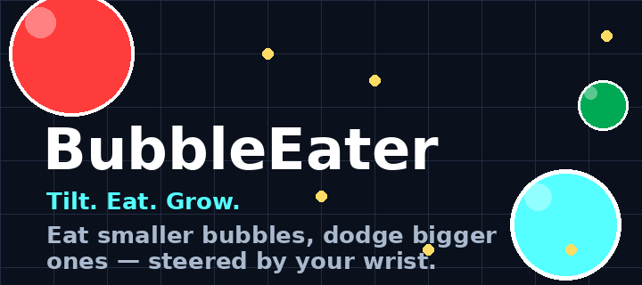
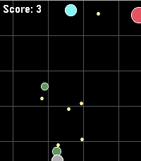
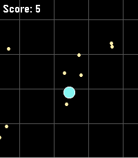
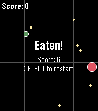

# BubbleEater



A bubble-eating arcade game for **every Pebble watch** — aplite, basalt,
chalk, diorite, emery, flint, and gabbro — controlled entirely by tilting the
watch (IMU/accelerometer). Eat smaller bubbles, dodge bigger ones, grow to
rule the arena.

| Action | Feeding | Game over |
|---|---|---|
|  |  |  |

## Gameplay

- Tilt the watch to steer your bubble (cyan) around a 600×600 world.
- Eat yellow food pellets and smaller bubbles to grow. Bigger = slower.
- Enemy bubbles are colored by threat: **red** can eat you, **green** you can
  eat, **gray** is too close in size for either. On black & white watches:
  solid means danger, hollow means edible, and your own bubble has a dark core.
- Enemies hunt food, chase you when you're edible, and flee when you're the
  threat. A bubble must be mostly engulfed before it's eaten — grazing a red
  bubble won't kill you.
- **Select**: pause/resume, or restart after being eaten.
- **Back**: quit.

### Rounds and upgrades

Reaching max size wins the round. You pick one of three upgrades, shrink back
to starting size, and play on against faster enemies. You can hold at most
three upgrades; picking one you already own levels it up (max level 3), and
when all slots are full you choose which one to drop.

- **Actives** (triggered with Up/Down during play, at most two held):
  **Dash** burns mass for a burst of speed, **Ghost** makes you briefly
  untouchable, **Freeze** stops enemies for a moment.
- **Passives**: **Magnet** pulls nearby food in, **Vampire** siphons mass from
  bigger enemies you graze, **Camo** hides you while you hold still, **Trail**
  slows enemies crossing your wake, **Mitosis** bursts eaten enemies into food,
  **Virus** spawns spiky viruses that pop enemies but not you.

## Implementation notes

- Pure C against the Pebble SDK, no external resources or libraries.
- ~30 fps `AppTimer` game loop polling `accel_service_peek()` for tilt input.
- Integer fixed-point (24.8) positions and velocities — no floating point.
- Area-conserving growth: `r' = √(r₁² + r₂²)`.
- Backlight is held on while the game is running.

## Building

Requires the [Pebble tool](https://developer.repebble.com/) and SDK 4.33+
(first SDK with emery support):

```bash
uv tool install pebble-tool
pebble sdk install latest
pebble build
```

> Note: after changing app metadata in `package.json` (version, platforms,
> etc.), run `pebble clean` first — the build caches the generated
> `appinfo.json` and won't pick up the change otherwise.

## Running in the emulator

```bash
pebble install --emulator emery
```

Simulate tilt from another terminal:

```bash
pebble emu-accel tilt-right    # also: tilt-left, tilt-forward, tilt-back
pebble emu-control             # live tilt control from your phone's sensors
```

Emulator buttons: `W`=Up, `S`=Select, `X`=Down, `Q`=Back.

## Installing on a watch

Enable the developer connection in the Pebble mobile app (Settings →
"Use LAN developer connection", then toggle "Dev Connection" in the watch's
⋮ menu — requires being signed in), note the IP it shows, then:

```bash
pebble install --phone <server-ip>
```

## Store assets

`store-assets/` holds the appstore listing material (icons, banner,
screenshots). Icons and banner are generated by:

```bash
uv run --with pillow store-assets/make_assets.py
```
